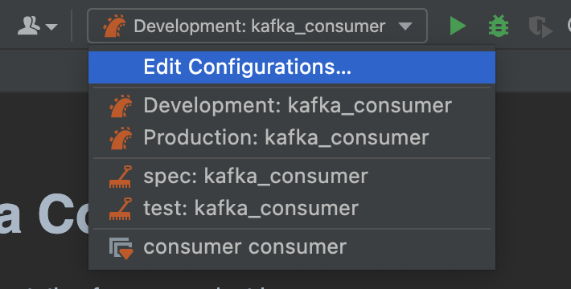
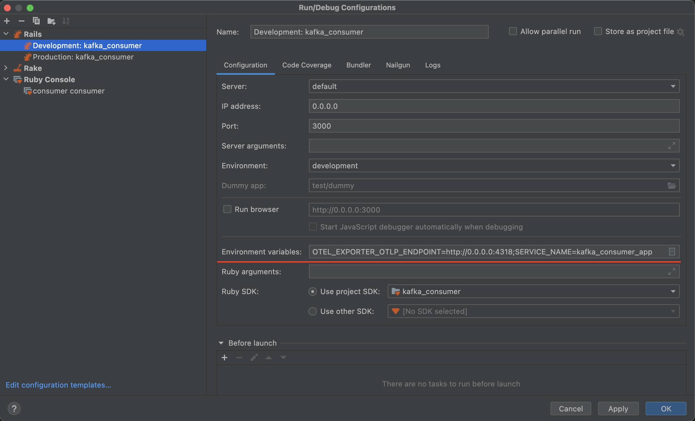
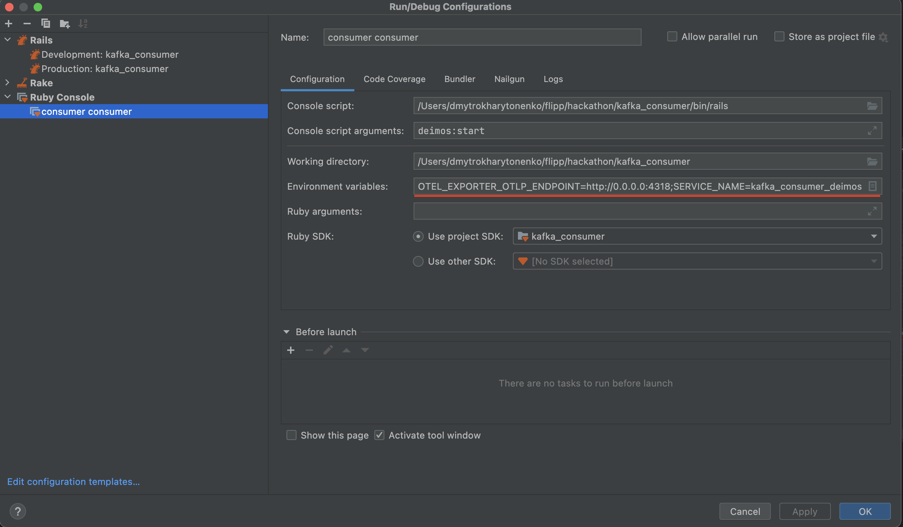

# Kafka Consumer
Add documentation for your project here.

## Table of Contents

* [Overview](#overview)
* [Local Setup](#local-setup)

## Overview

Test application to consume Kafka messages and pass daya to OpenTelemetry

## Local Setup

First [install RVM](https://rvm.io/rvm/install).

Install and run OpenTelemetry is you need it:

`git clone git@github.com:open-telemetry/opentelemetry-ruby.git; \
cd opentelemetry-ruby/examples/otel-collector; \
docker-compose up -d`

Config 2 services in RubyMine configurations
Press `Edit configuration`

1. Development: kafka_consumer
Add to environment variables: `OTEL_EXPORTER_OTLP_ENDPOINT=http://0.0.0.0:4318;SERVICE_NAME=kafka_consumer_app`

2. Add new `Ruby Console` by pressing `+` in left top corner of Run/Debug Configuration popup window
* Console script: `path_to_app_forder/bin/rails`
* Console script arguments: `deimos:start`
* Working directory: `path_to_app_folder`
* Environment variables: `OTEL_EXPORTER_OTLP_ENDPOINT=http://0.0.0.0:4318;SERVICE_NAME=kafka_consumer_deimos`

